# real-estate-agent

A scheduled data agent that tracks the U.S. housing market nationally and
across the 50 largest metros: sales, prices, inventory, days on market, price
cuts, rents and permits, set against mortgage rates. Every number is computed
in Python. Claude writes the narrative (a brief per metro, a national summary,
and a tool-using **metro investigator** that explains *why* a market is moving),
and every sentence it writes is checked number-by-number against the computed
facts before it's published. Built on
[`agents-core`](https://github.com/Kghaffari26/agents-core) **v0.3.1**, publishing
to its data-branch contract for a portfolio site.

## Highlights

- **Agent loop.** `agents/real_estate/investigate.py` runs an
  `agents_core.agent_loop.AgentLoop` for up to 3 metros a run: those with a new
  `major` flag, else the top mover. It has 5 read-only tools (metro series, 5
  same-region peers, national context, rate history, similar past episodes) and a
  `finish(explanation, cited_metrics)` tool. Budgets are 8 steps and $0.05 per
  investigation, with a graceful partial result and a template if a budget runs
  out. Tool outputs are wrapped as untrusted data, and the rate tool isn't offered
  when there's no rate data. It's published additively as
  `metros[slug].investigation` and `latest.json` → `investigations` (spec §6.3).
- **Guards.** The number guard (`agents_core.guards`) checks every brief and every
  investigation against the facts the model was given: for the investigator, that's
  everything its tools returned in that run. A failure gets one retry naming the bad
  numbers, then a deterministic template (`narrative_source: "template"`). `finish`
  also rejects anything but 4–6 sentences, unknown metric keys, and computed
  multiples ("4.3 times"), which the number guard can't catch
  ([case study 3](docs/case-studies.md#3-the-investigator-computed-43-times-and-the-number-guard-passed-it-by-coincidence)).
  In live runs the guard has caught 4 mis-rounded or invented figures out of 150
  metro briefs, and all 4 were fixed on the retry.
- **Evals** (`agents_core.evals`, `evals/real_estate/suites.py`), latest scores from
  [`evals/history.jsonl`](evals/history.jsonl):

  | Suite | Cases | Pass rate | Scores | Cost |
  |---|---:|---:|---|---:|
  | template briefs (offline) | 14 | 1.000 | number fidelity, units, style, length, flag coverage: all 1.000 | $0.00 |
  | LLM metro briefs | 12 | 1.000 | guard first-try 1.000, flag-coverage LLM judge 1.000 | $0.033 |
  | investigator (trajectory) | 6 | 1.000 | required/forbidden tools, max steps, stop reason, guard, 4–6 sentences, cites trigger: all 1.000; **LLM-judge quality 0.833** | $0.123 |

  A PR workflow (`.github/workflows/evals.yml` → agents-core's
  `run-evals.yml@v0.3.1`, $0.25 cap per suite, $0.40 total) fails on a score drop over 0.10.
  The 6 investigator trajectories are recorded and replay offline in `pytest`.
- **Tracing.** Every run publishes `trace.json` (`agents_core.tracing`): spans for
  each phase, this agent's `fetch:redfin` / `metro_briefs` / `national_brief` /
  `investigations` steps, every LLM call, tool call and guard check, with tokens,
  cost and latency. `manifest-entry.json` carries the `trace_summary`.
- **Costs.** A run that regenerates everything (50 metro briefs through the Batch
  API, the national brief, 1 investigation) cost **$0.059**. An unchanged week
  costs **$0.00**: briefs and investigations are reused while their facts hashes
  match. An investigation alone costs $0.014–0.025 (3–4 steps; after the first
  step the prompt cache brings input down to a few uncached tokens). Every run is
  capped by `MAX_RUN_USD`. With no API key the run still publishes, with templates
  and a warning in `meta.warnings`.

## Demo

A live run on 2026-09-27 (Redfin data through May 2026). No metro had a *new*
major flag, so the investigator took the top mover, Pittsburgh (+7.8% YoY).
Its trajectory from `trace.json`:

```
agent_loop investigate:pittsburgh-pa  4 steps · 8 tool calls · stop_reason=finished · $0.0192 · 19.1s
  step1  get_metro_series  compare_to_peers  get_national_context  get_rate_history
  step2  find_similar_episodes  get_metro_series
  step3  compare_to_peers  compare_to_peers
  step4  finish → number guard: pass
```

`public-data/metros/pittsburgh-pa.json` → `investigation.explanation`:

> Pittsburgh's 7.8% median price increase is the strongest among its five closest
> regional peers, despite a national trend of 2.2% growth. While homes sold in
> Pittsburgh fell 7.3% year-over-year, this decline is smaller than the peer median
> of -10.5%, suggesting relatively resilient demand compared to neighboring Northeast
> markets like Philadelphia, Boston, and New Brunswick. Inventory grew 5.2%
> year-over-year in Pittsburgh, exceeding the national decline of -9.0%, so the price
> growth is not driven by supply constraints. The market has tightened recently:
> median days-on-market fell from 92 days in February to 50 days by May, indicating
> faster sales velocity in the current period. The price strength appears to reflect
> residual momentum from a sustained 17-month appreciation cycle (August 2024-December
> 2025) that peaked at 15.4% YoY gains, combined with Pittsburgh's outperformance in
> retaining buyers relative to other Northeast metros as mortgage rates rose 0.69
> percentage points over the past year.

Every figure in it came from a tool call in that run. The earlier drafts that
reasoned backwards or computed a multiple are in
[docs/case-studies.md](docs/case-studies.md). To reproduce:

```bash
uv run agents-run real_estate --dry-run      # free: prints the table and "investigate: <slug> (...)"
uv run agents-run real_estate                # live: briefs + investigations → public-data/
jq .investigations public-data/latest.json
jq '.spans[] | select(.kind=="agent_loop" or .kind=="tool_call") | {kind,name,duration_ms}' public-data/trace.json
uv run pytest tests/test_investigate.py -k replay   # the 6 recorded trajectories, offline
```

## Dashboard

**Metro Pulse** (`dashboard/`) is the market-intelligence front end for this agent's
output: a national overview, all 50 metros on a MapLibre map and in a sortable
table, a page per metro, a comparison view and a methodology page. It's live at
<https://kghaffari26.github.io/real-estate-agent/> and redeploys by
`.github/workflows/dashboard.yml` after every push to it and after every
successful agent run.

- **Numbers from the agent.** Types are generated from
  `schemas/real_estate.schema.json`, and parsing is tolerant: older files and bad
  items never crash a view. The only client-side math is formatting,
  indexed-to-100 comparisons and the mortgage calculator, which reproduces all 50
  published payments.
- **Design.** Inter with tabular figures, token-driven light and dark palettes, and
  validated colorblind-safe chart colors. No dual axes. There's a ⌘K command
  palette, deep links on everything, PNG and CSV export, and a print-ready metro
  one-pager.
- **Quality.** Axe-clean on every route in both themes; no horizontal scroll at
  360 px; 109 KB of initial JS (budget 300 KB, checked in CI). Lighthouse on the
  Overview: performance 96 mobile and 99 desktop, accessibility 100.

```bash
cd dashboard && npm ci && npm run fetch-data && npm run dev
```

Details, including how to restyle and rebrand: [`dashboard/README.md`](dashboard/README.md).

| | Light | Dark | Mobile |
|---|---|---|---|
| **Overview** | 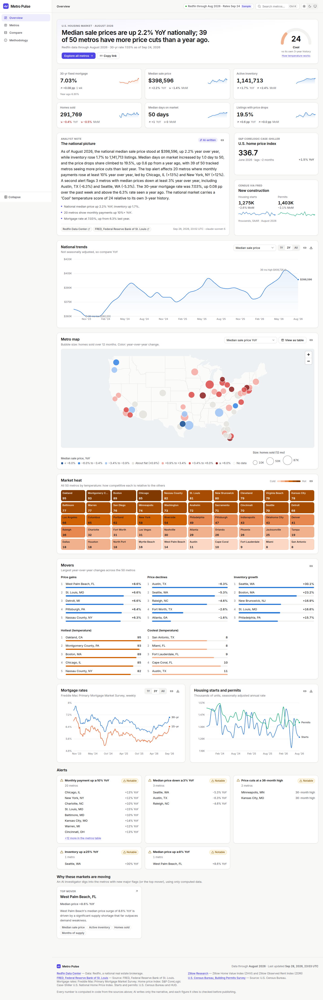 | 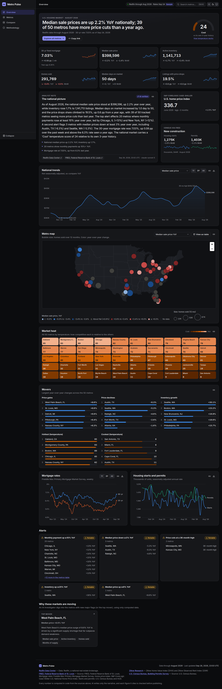 | 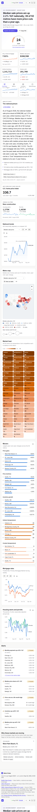 |
| **Metros** | 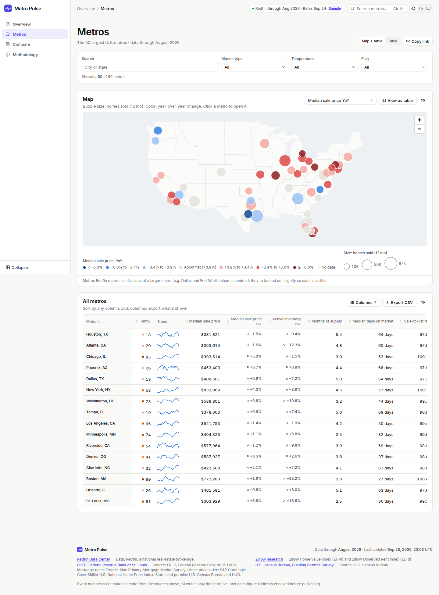 | 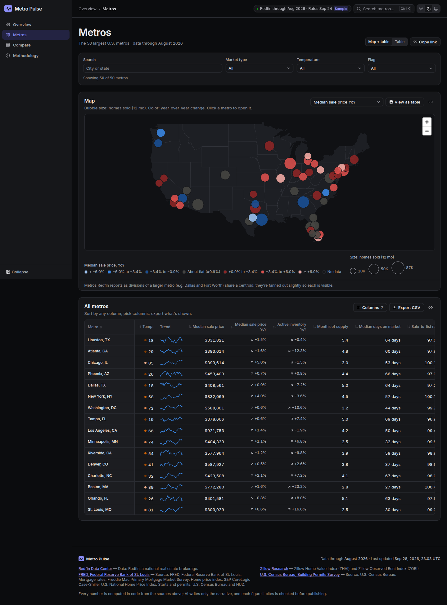 | 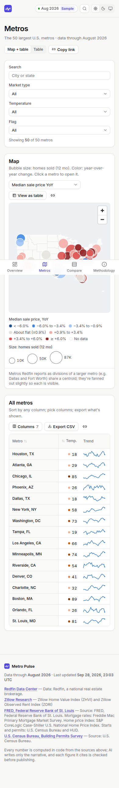 |
| **Metro** | 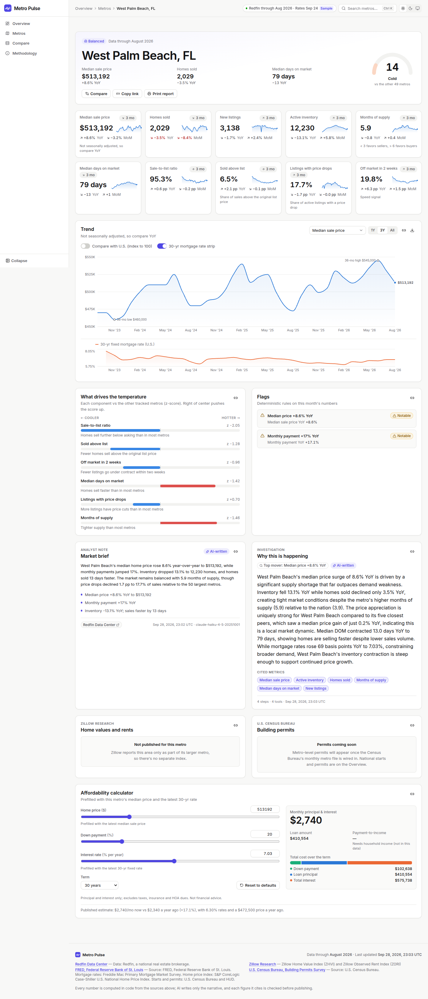 | 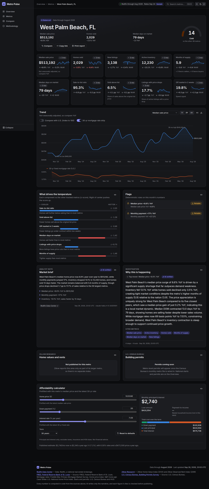 | 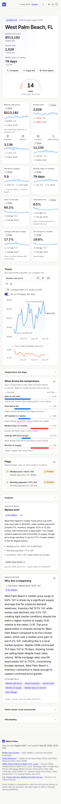 |
| **Compare** | 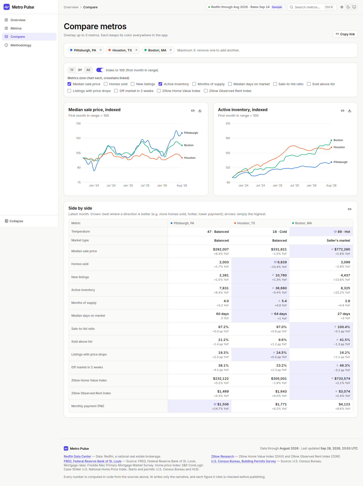 | 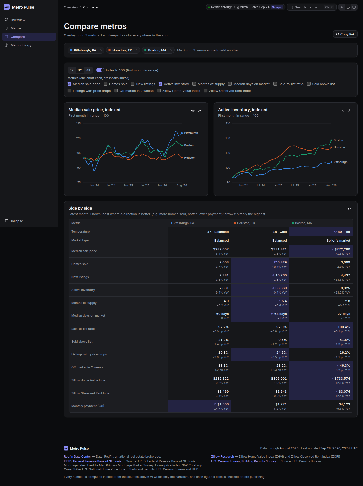 | 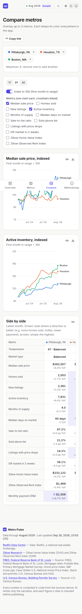 |
| **Methodology** | 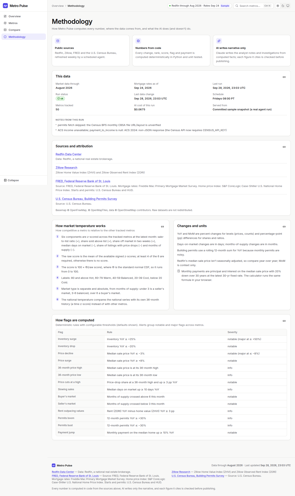 | 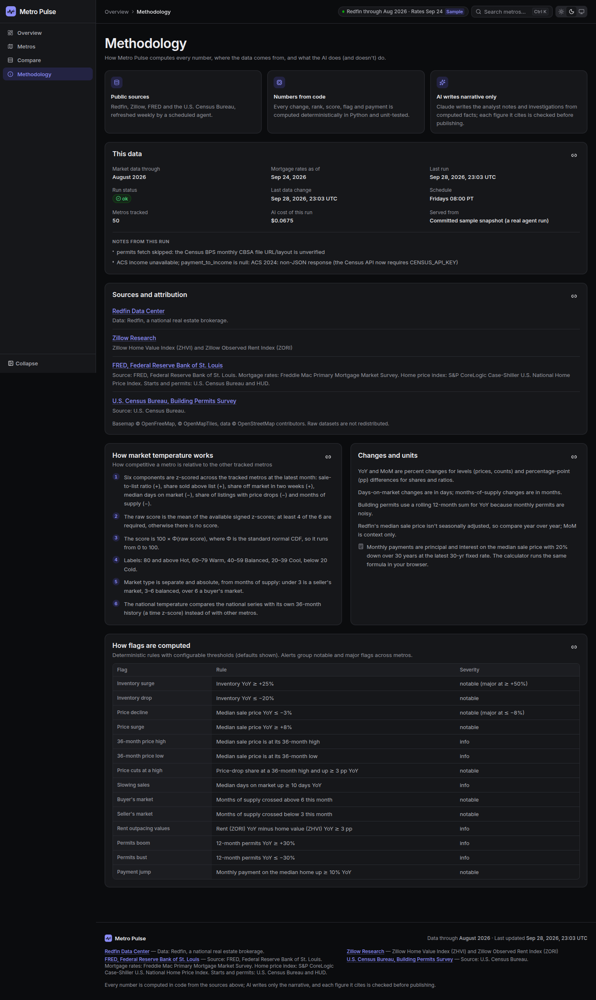 | 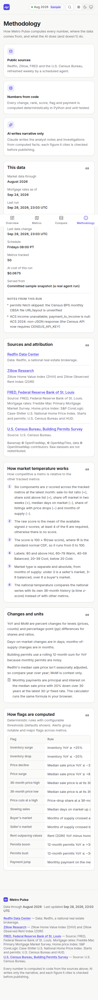 |

The screenshots use an offline stand-in basemap (U.S. outline) because map tiles
aren't reachable where they're taken; the live site uses OpenFreeMap.

## How it works

```
fetch (conditional GET) → filter/normalize → compute (YoY/MoM/trend/
  percentile-rank) → flags + market temperature → movers → facts dicts
  → briefs (Claude, only where facts changed; number guard; template
  fallback) → investigations (agent loop over computed data; guard; template)
  → validate against a pydantic schema → publish JSON + history + trace
```

- **Framework**: `agents/real_estate/agent.py` defines `RealEstateAgent`, an
  `agents_core.agent.Agent` (fetch → transform → analyze), registered under
  the `agents_core.agents` entry point in `pyproject.toml`. agents-core's
  `agents-run` does the rest: validation, publishing, cost tracking, the
  manifest entry, and the JSON Schema.
- **Data sources**: Redfin's public Data Center (metro + national market
  tracker), Zillow Research (ZHVI/ZORI), FRED (mortgage rates, housing
  starts, Case-Shiller), and the Census Bureau (ACS income, Gazetteer
  centroids; building permits are wired but disabled until the monthly file
  layout is verified). Zillow/permits/ACS/FRED are optional: a failure
  degrades that field to `null` and logs a warning instead of failing the run.
- **Every number comes from Python, not an LLM.** YoY/MoM changes,
  36-month highs/lows, percentile ranks, the market-temperature z-score,
  every flag threshold, the headline, and the amortization-based
  affordability calculator are deterministic and unit-tested.
- **Briefs**: metro briefs use the fast tier through Anthropic's Batch API
  (half price); the national brief uses the smart tier. Both go through
  `agents_core.llm` with `fields_guard(facts, ["text", "key_points"])`: a
  number that isn't in the facts gets one retry, then the deterministic
  template from `templates.py` (`narrative_source: "template"`).
- **Investigations**: see Highlights and spec §6.3. The loop's tools read a
  snapshot (`investigate.World`) of the same computed series the metro files
  publish.
- **Caching**: a brief or investigation is regenerated only when the facts it was
  written from change (SHA-256 in `data/real_estate/state.json`). The text itself
  is reused from the previous published output, which agents-core's workflow
  restores from the `data` branch before each run. Metro briefs don't see mortgage
  rates, so a rate-only week regenerates just the national brief (and the
  investigations, which can cite rates), and an unchanged week makes zero LLM calls.

## Setup

```bash
uv sync                 # Python 3.12; installs agents-core v0.3.1 from git
cp .env.example .env    # ANTHROPIC_API_KEY (or AGENTS_ANTHROPIC_API_KEY), FRED_API_KEY, CENSUS_API_KEY
```

## Running

```bash
uv run agents-run real_estate --dry-run        # fetch + compute, print a per-metro table; no LLM, no publish
uv run agents-run real_estate                  # real run: briefs + publish to public-data/
uv run agents-run real_estate --force-briefs   # regenerate every brief and investigation
uv run agents-run --list                       # every registered agent
```

Output follows the agents-core data-branch contract, in `public-data/`
(override with `AGENTS_CORE_PUBLISH_DIR`):

```
public-data/
├── latest.json              # the index (§6.1): national block, 50 metro summaries, movers, alerts
├── metros/<slug>.json       # one per metro (§6.2): full series, flags, affordability, brief
├── history/YYYY-MM-DD.json  # dated index snapshots, 52 kept
├── manifest-entry.json      # headline, key stats, run cost, status
├── costs-summary.json       # this agent's monthly/all-time LLM spend
├── schema.json              # latest.json's JSON Schema
├── trace.json               # this run's spans (redacted, size-capped)
└── trace.schema.json
```

In CI, `.github/workflows/agent-real-estate.yml` runs this weekly (Fridays
08:00 PT) through agents-core's reusable `run-agent.yml@v0.3.1`. That workflow
declares no permissions of its own, so the calling job grants
`contents: write`; no `issues: write`, because this agent opens no issues. It
restores the `data` branch into `public-data/`, runs the agent, commits `data/`
(cost log, guard failures, `state.json`) back to the branch, and force-pushes
`public-data/` to the `data` branch.

## Costs

From `data/costs.jsonl` and `data/eval_costs.jsonl`:

| Run | Calls | Cost |
|---|---|---:|
| Everything regenerated (2026-09-27): 50 metro briefs (Haiku 4.5, Batch API), 1 guard retry, national brief (Sonnet 5), 1 investigation (3 steps) | 55 | $0.0586 |
| Immediate second run (all reused) | 0 | $0.00 |
| Investigation only, after a prompt change (4 steps) | 4 | $0.0192 |
| Eval suites: template / LLM briefs / investigator | 0 / 24 / ~30 | $0 / $0.033 / $0.123 |

Weeks where only the mortgage rate moved regenerate the national brief and the
investigations (about $0.03 with one investigation). Every run is capped at `MAX_RUN_USD=0.50`
(agents-core checks the worst case before each call), each investigation at $0.05,
and each eval suite at `AGENTS_CORE_EVAL_MAX_USD`.

## Tests and evals

```bash
uv run pytest                              # HTTP mocked (respx), Anthropic faked or replayed; no network, no spend
uv run ruff check .
uv run python -m evals.real_estate.run     # the offline template suite (free)
uv run agents-evals run evals.real_estate.suites:TEMPLATE_BRIEFS evals.real_estate.suites:LLM_BRIEFS evals.real_estate.suites:INVESTIGATOR --max-usd 0.30
uv run agents-evals compare --threshold 0.10
```

- `tests/test_agent_run.py` runs the whole agent through agents-core's runner
  offline: every data-branch file including `trace.json`, the investigation, a
  second run with zero LLM calls, and a run with no API key (templates, status ok,
  a warning).
- `tests/test_investigate.py` covers the tools, budgets (steps and USD, checked
  before each call), the guard's retry-then-template path, and deterministic replay
  of the 6 recorded trajectories (`evals/real_estate/trajectories/`).
- The investigator eval fixtures (`evals/real_estate/investigator_world.json`,
  `investigator_cases.jsonl`) are a snapshot of live data, rebuilt with
  `uv run python scripts/build_investigator_fixtures.py`.

## Config

- `config/metros.toml` — the 50 tracked metros (Redfin region name, Zillow
  RegionID, CBSA code, lat/lon), generated by `scripts/build_metro_config.py`
  from live Redfin, Zillow and Census Gazetteer data, then hand-reviewed.
  Remaining `# REVIEW` lines are listed in STATUS.md.
- `config/real_estate.toml` — flag thresholds and pipeline settings
  (including the index/metro size limits and the batch timeout).
- `config/models.toml` (optional) — overrides agents-core's default model
  tiers/pricing.

## Network note

`scripts/verify_re_sources.py` checks every source URL. All of them were
reachable from the last dev session; the Census API now needs
`CENSUS_API_KEY` for ACS income.
