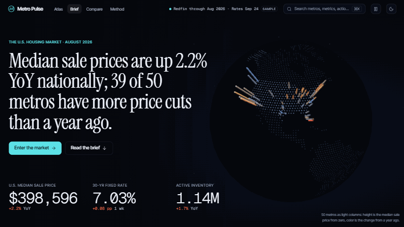

# Metro Pulse — the dashboard

**Metro Pulse v2 ("Night Atlas")**: a living 3D atlas of the U.S. housing market built
on the `real_estate` agent's published data. You arrive at a globe, dive into a
tilted 3D map of 50 metros, scrub monthly history back to 2012, search any radius
down to counties, open a metro's dossier (a 3D house lit by its market's
temperature), set your own numbers in the affordability studio, and compare three
metros side by side. Every number is the agent's; the dashboard formats, positions
and animates it. Every view and setting is deep-linkable.



Trailer (~45 s): [`docs/media/trailer.webm`](../docs/media/trailer.webm). Stills:
[`docs/screenshots/v2/`](../docs/screenshots/v2/).

**Stack:** Vite, React 18, TypeScript (strict), Tailwind (token-driven), React
Router (hash router), MapLibre GL 6 + deck.gl 9 (the atlas and the globe, lazy),
three.js via react-three-fiber (the houses, lazy), framer-motion and GSAP
(ScrollTrigger), zustand (the time machine), d3-geo, and self-hosted Instrument
Serif, Inter Tight and Geist Mono (`@fontsource`). Tests: Vitest + Testing Library,
Playwright with axe, Lighthouse. Deployed to GitHub Pages at `/real-estate-agent/`
by `.github/workflows/dashboard.yml`.

## Run locally

```bash
cd dashboard
npm ci
npm run fetch-data      # the data branch, else the committed sample snapshot
npm run dev             # http://localhost:5173/real-estate-agent/
```

| Command | What it does |
|---|---|
| `npm run fetch-data` | Fill `public/data/` (see "Data flow"). `RE_DATA_DIR=../public-data npm run fetch-data` uses a local agent run instead. |
| `npm run gen:schema` | Regenerate `src/data/schema.gen.ts` from `../schemas/real_estate.schema.json`. `check:schema` fails if it's stale. |
| `npm run lint` / `typecheck` / `test` | ESLint (0 warnings), `tsc -b`, Vitest + Testing Library. |
| `npm run build` / `preview` | Production build into `dist/`. `DASHBOARD_BASE` overrides the base path. |
| `npm run check:bundle` | Performance budget: initial JS ≤ 300 KB gzipped (CI enforces it; the spec allows 350). |
| `npm run e2e` | Playwright: axe (WCAG 2.1 AA) on every route in both themes, desktop and 360 px, the forced low tier and reduced motion, every interaction in the spec, and a frame-timing smoke (warning only). |
| `npm run lighthouse` | Lighthouse on Arrival and Explore, mobile and desktop, against `vite preview` (accessibility must be 100; performance is reported). |
| `npm run visual` / `visual:update` | Visual regression: every route × both themes × 390/1024/1440 px + the low tier, against local baselines. |
| `npm run screenshots` | Rewrite `../docs/screenshots/*.png`: every view in light, dark and mobile. |
| `npm run brand-assets` | Re-render `public/og.png` and `public/apple-touch-icon.png` from the brand config. |

`predev` and `prebuild` run `fetch-data --if-missing`, so a fresh checkout just works.

## Data flow

```
agent run ──► data branch (latest.json, metros/*.json, manifest-entry.json, history/)
                     │  npm run fetch-data (git fetch origin data → FETCH_HEAD; no branch changes)
                     ▼
sample-data/ ──► public/data/  +  source.json {source: data-branch | sample | local}
 (fallback)          │  fetched at runtime from <base>/data/
                     ▼
    src/data/api.ts ── zod (schema.gen.ts, tolerant) ──► hooks ──► view models ──► components
```

- **Contract.** The zod schemas and TS types are generated from the agent's JSON
  Schema (`scripts/gen-schema-lib.mjs`). A unit test and CI fail when they're stale.
- **Tolerant parsing** (`src/data/tolerant.ts`):
  - A missing optional field gets its default.
  - A malformed array item or map entry is dropped with a `console.warn`.
  - Numeric series coerce bad values to `null`.
  - Only a missing required top-level block fails a view, which then shows an
    illustrated error state with a retry.
- **Sample data.** `sample-data/` comes from a real agent run on 2026-09-28: Redfin
  Data Center through **August 2026**, rates as of 2026-09-24, $0.0675 of Claude
  spend. It holds the full index, all 50 metro files, the manifest entry and one
  history file, with nothing hand-edited. While it's in use, the freshness chip
  shows **Sample**.
- **Cache-busting.** Every data URL carries `?v=<content hash of public/data>`,
  computed at build time (`scripts/data-version.mjs`, injected by `vite.config.ts`).
  GitHub Pages lets browsers cache JSON for ~10 minutes, so a fixed URL could pair
  a freshly deployed app with the previous deploy's data. With the hash, each build
  fetches exactly its own data, and an unchanged dataset keeps its cache.
- **Timelines (schema 1.3.0).** `timeline/<metric>.json` holds monthly history since
  2012 for five metrics; the index's `timelines` lists which exist, and the atlas's time
  machine loads one on first scrub (Jan 2013 onward, so every month has a YoY).
- **Events, pulse, counties (schema 1.4.0).** `events.json` is the time machine's
  moments rail and the Arrival rate chart's markers (detected by the agent; the
  dashboard only places and labels them, `lib/moments.ts`); `pulse.json` feeds the
  Arrival ticker and the dossier's "last 12 weeks"; `areas/<slug>.json` feeds the
  dossier's county table and area search, which loads only the county files of metros
  near the ring. Each is fetched only when the index lists it, and a missing or
  unreadable file just hides its feature (`loadEvents` / `loadPulse` / `loadArea`).
- **Sparklines.** The Metros table draws each row's trend from the index's
  `metros[].spark` (schema 1.2.0), so it fetches no metro files.
- **Units.** Metric values and changes are ratios (0.968 → 96.8%, 0.009 → +0.9 pp).
  Mortgage rates and `key_stats` are already in percent (7.03 → 7.03%). See
  `lib/metrics.ts` (`valueScale`) and `lib/format.ts` (`scale`).

## Architecture

```
src/
├── config/        brand.ts (name, tagline, URL, theme colors), features.ts (stubs, off)
├── data/          schema.gen.ts (generated from the agent's schema), api.ts (loaders,
│                  tolerant optional files), hooks, manifest.ts
├── lib/           pure, unit-tested logic: format (every StatFormat), amortization,
│                  studio, dossier (house scale, temperature light), area (radius and
│                  county search), columns, timeline, moments (the event rail), quality
│                  (tiers), series, metrics, csv, tokens, text…
├── viewmodels/    pure data → display models: atlas, dossier, compare, pulse, overview…
├── state/         timeStore (the time machine, zustand)
├── ui/            v2 primitives: AtlasChrome, CommandBar, Glass, controls (Button, Chip,
│                  Segmented, Slider, Toggle), Scrubber, Instrument, Dock, Counter, dataviz
├── atlas/         the 3D map (MapLibre + deck.gl, lazy), the designed 2D atlas, panels,
│                  the table view, the MapLibre 6 compatibility shim
├── arrival/       the globe (deck.gl GlobeView), story sections, the pulse ticker
├── dossier/       the 3D house (three.js), its isometric SVG twin, region plates, charts
├── studio/        the payment stack
├── compare/       the arena (three houses) and the linked-crosshair charts
├── components/    shared pieces kept from v1: CommandPalette, MetroSearch, state views,
│                  alert/flag/investigation cards
├── pages/         containers: URL state + data hooks → view models → components
├── hooks/         useQueryState (URL = state), useQuality, useTheme, EntityColors, Toast…
└── styles/        atlas.css (the v2 tokens), tokens.css (shared v1 tokens), index.css
```

Every route is deep-linkable:

| Route | Query parameters |
|---|---|
| `#/` (Arrival: globe, brief, heat field, rates vs prices, movers, investigations) | none |
| `#/explore` (the atlas) | `?m=&t=YYYY-MM&style=&h=value|yoy&by=&b=0&terrain=1&pin=lat,lon&r=10-250&sel=a,b&view=table&cam=lon,lat,zoom,pitch,bearing&tier=low` |
| `#/metro/:slug` (dossier) | `?m=&range=1Y|3Y|All&mode=yoy&vs=1&section=affordability&tier=low` (v1's `?metric=` still works) |
| `#/metro/:slug/afford` (affordability studio) | `?price=&down=&rate=&term=15|20|30&tier=low` |
| `#/compare` (the arena) | `?m=a,b,c&metrics=x,y&range=1Y\|3Y\|All&indexed=1&tier=low` |
| `#/methodology` (`#/about` redirects) | `?section=<id>` |
| `#/metros`, `#/arrival`, `#/dossier/:slug` | redirects to `#/explore?view=table`, `#/`, `#/metro/:slug` |
| `#/styleguide` (v2 design system) | none |

Any view also takes `?section=<id>` to scroll to a section. "Copy link" buttons
produce these URLs.

## Quality tiers

`src/lib/quality.ts` (spec §9) picks a tier once per page load from browser hints;
`?tier=low|medium|high` overrides it (tests and screenshots use it).

| Tier | When | What it gets |
|---|---|---|
| **High** | WebGL2 and a capable machine | 3D everywhere, terrain available, 3D buildings from zoom 12, DPR ≤ 2 |
| **Medium** | phones, ≤ 4 cores or ≤ 4 GB, save-data, or software GL | 3D, no terrain, buildings from zoom 13, DPR ≤ 1.5 |
| **Low** | no WebGL2, < 2 cores or < 2 GB | the designed 2D atlas, the globe poster, the isometric SVG houses |

Reduced motion keeps the tier's visuals minus every decorative animation (high is
capped at medium). Save-data connections keep the globe poster instead of loading
the WebGL globe. Detection doesn't use detect-gpu, which downloads its benchmark
tables from a CDN on every visit. There is no bloom pass in any tier.

## How to restyle

1. **Tokens first.** `src/styles/atlas.css` defines the v2 palette for Night
   (`.dark`, the default) and Dawn: surfaces, ink, the accent, the cool/hot data ramps,
   the temperature light and the entity colors `--mp-e1..e3`. `tailwind.config.js`
   maps them to `mp-*` utilities. Change a token, and panels, the map, the houses and
   the charts follow in both themes.
2. **Primitives.** `src/ui/` (GlassPanel, controls, Scrubber, Instrument, CommandBar)
   and the `/styleguide` route, which shows every primitive in both themes.
3. **Motion.** `src/motion/presets.ts` (durations, springs, variants). Every animation
   honors `prefers-reduced-motion` and the command bar's media pause.
4. **Views** take preformatted props; pages and view models own the data, so a
   restyle never touches `lib/`, `data/` or `viewmodels/`.
5. Keep `npm run e2e` (axe everywhere) and `npm run lighthouse` (accessibility 100)
   green, and review `npm run visual` diffs.

## How to rebrand

1. `src/config/brand.ts`: name, tagline, description, site URL, theme colors.
   `vite.config.ts` injects these into `index.html` (title, description, Open
   Graph/Twitter tags, theme-color); the UI reads the same object.
2. The mark: `AtlasMark` in `src/ui/CommandBar.tsx`, `public/favicon.svg`, and the
   `MARK` geometry in `scripts/make-brand-assets.mjs`.
3. The accent: `--mp-accent*` in `src/styles/atlas.css`, for both themes.
4. `npm run brand-assets` re-renders `public/og.png` (1200×630) and
   `public/apple-touch-icon.png`.
5. Regenerate the media (below) and `npm run screenshots`, then check the READMEs.

## How to regenerate media

All media is rendered from the running app, never generated or stock. Start
`npx vite preview --port 4173` in `dashboard/`, then:

| Output | Command (from `dashboard/`) |
|---|---|
| Trailer (`docs/media/trailer.webm`, ~45 s, 1280×720) and README hero (`docs/media/hero.gif`, 800×450) | `node design/trailer/record.mjs` (or `… trailer` / `… gif`). Uses this machine's GPU; no ffmpeg: the trailer is Playwright's own WebM and the GIF is encoded with gifenc. |
| Arrival globe posters (`public/media/arrival-globe-*.jpg`) | `node design/arrival/poster.mjs` |
| Design stills (`docs/screenshots/v2/`) | `node design/<phase>/shots.mjs`, e.g. `design/compare/shots.mjs`, `design/p8-shots.mjs` |
| README screenshots (`docs/screenshots/*.png`) | `npm run screenshots` |
| Frame timing on this GPU | `node design/fps.mjs` |

Committed site media stays small (`public/`: 1.6 MB); the trailer and GIF add 7.4 MB
under `docs/`.

## Performance

- **Initial JS: 72 KB gzipped** (budget 300 KB, `npm run check:bundle` in CI).
- **Lazy chunks:** MapLibre ~272 KB, deck.gl ~224 KB (the atlas and the globe),
  three.js ~215 KB (the houses), GSAP ScrollTrigger ~18 KB, and every page.
- **Poster first.** `index.html` paints Arrival's globe poster before any JS loads and
  preloads `latest.json`; the WebGL globe replaces it after first paint.
- **Frame rate** (`design/fps.mjs`, AMD Radeon 860M integrated): 60 fps panning and
  tilting the atlas; the time machine at 4× holds the display rate.
- **Lighthouse** (Lighthouse 12, local `vite preview`, software WebGL):

  | Route | Accessibility | Best practices | Performance (mobile / desktop) | LCP (mobile / desktop) |
  |---|---|---|---|---|
  | Arrival | 100 | 100 | 43 / 74 | 5.8 s* / 0.4 s |
  | Explore | 100 | 100 | 44 / 77 | 6.9 s / 1.4 s |

  \*Lighthouse's simulated throttling replays the LCP element of an unthrottled load,
  where React covers the pre-JS poster before it paints; with applied throttling
  (`npm run lighthouse -- --applied`, slow 4G + 4× CPU) Arrival's mobile LCP is
  **2.2 s**, the poster. Performance scores here are dominated by WebGL running on the
  CPU (SwiftShader), which no phone with a GPU pays; they are reported in CI, not
  enforced. Accessibility 100 is enforced.

## Known limitations

- **Basemap in tests.** OpenFreeMap tiles are unreachable from CI and the build
  sandbox, so e2e tests and screenshots use an offline stand-in style (U.S. land and
  state lines from `us-atlas`). The live site uses OpenFreeMap's `positron` and `dark`
  styles. If WebGL or the basemap fails, the atlas switches to its designed 2D mode,
  and the table view always lists every metro.
- **Missing sources.** Permits and ACS income are null in the current data, so those
  panels show plain empty states and payment-to-income waits for income data.
- **Visual baselines are local** (`e2e/__visual__/`, gitignored): WebGL and font
  rendering differ by OS and GPU, so they are regenerated and reviewed at each gate
  rather than committed.
- **Save** (`src/config/features.ts`) is a hidden stub for the accounts work in the
  next spec.
